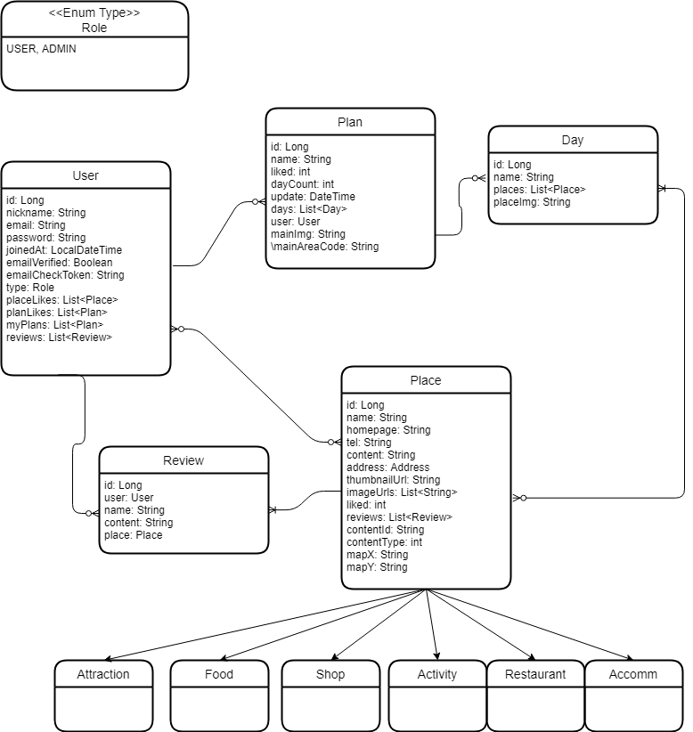
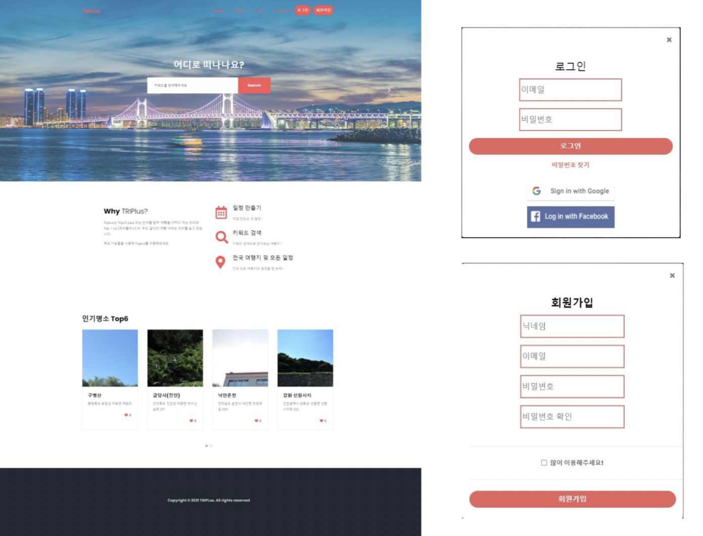
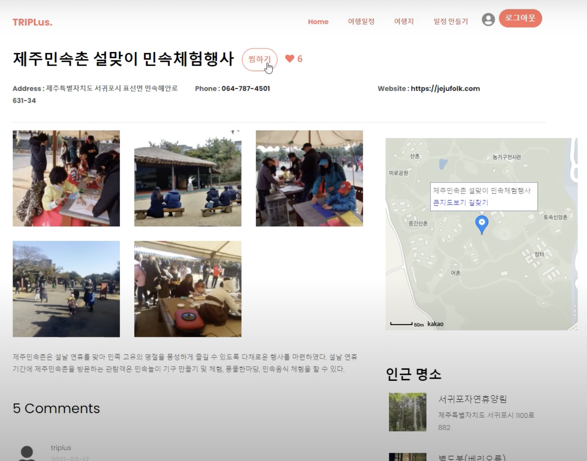
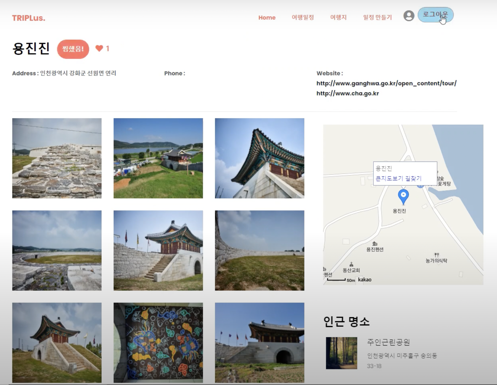
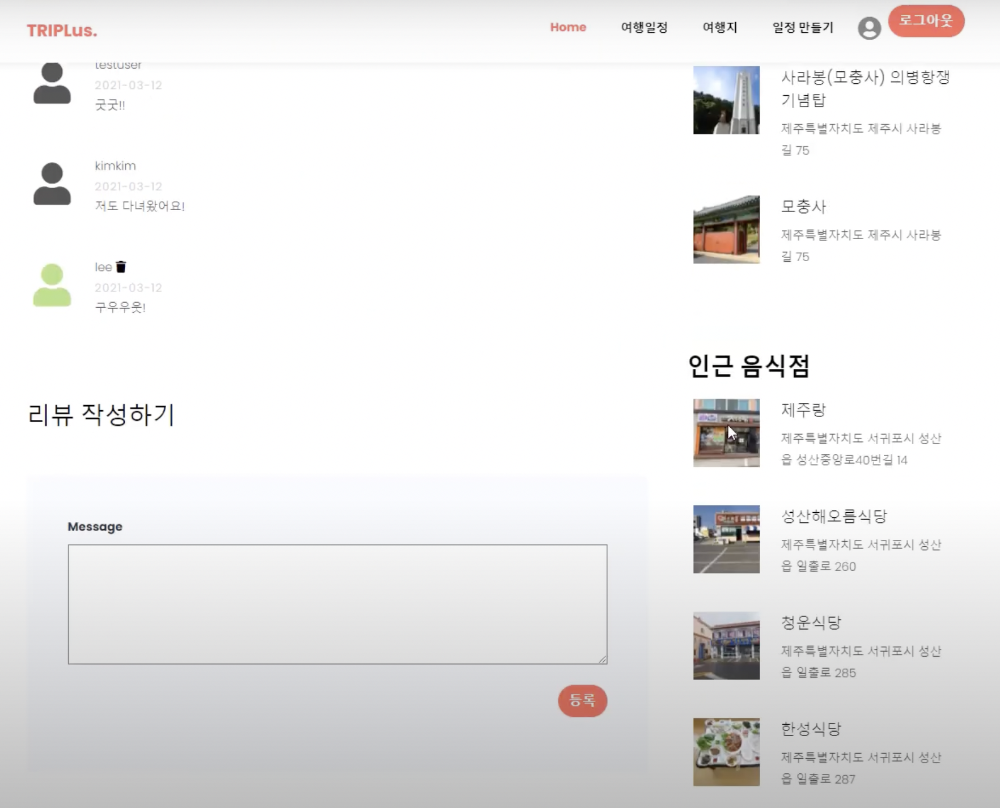
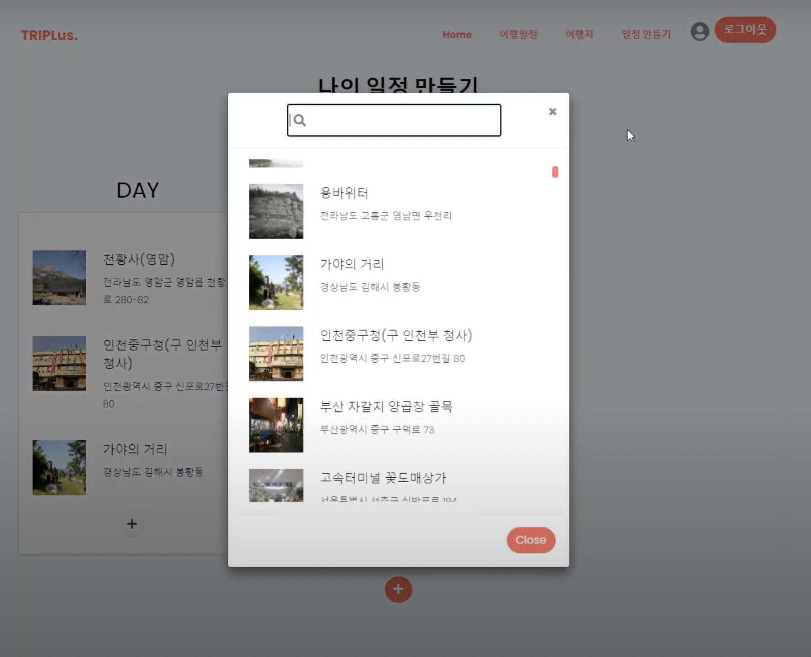
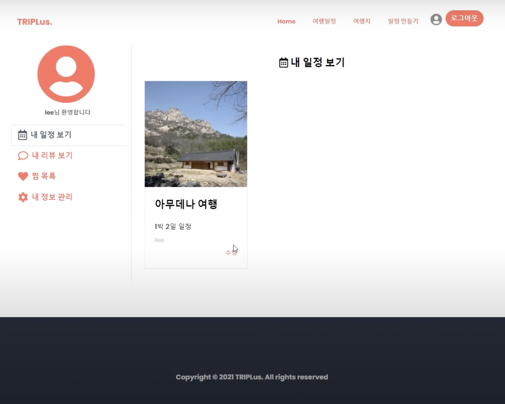
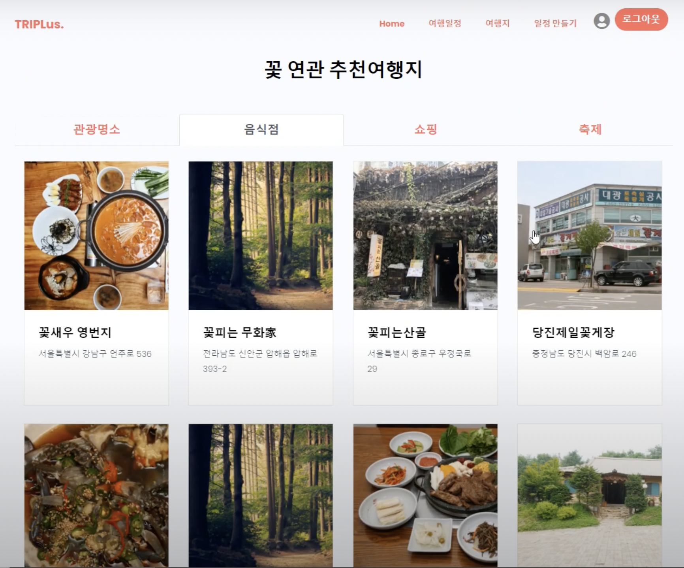
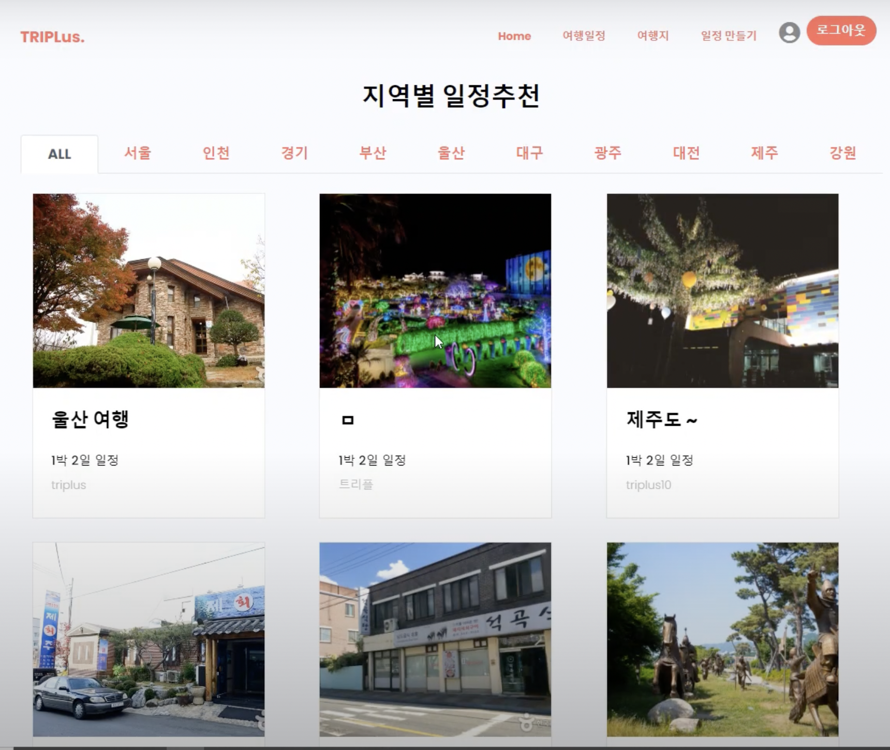

# TRIPLus

😄 **즐거운 여행을 위한 TRIPLus** 😄

Triplus는 Trip과 plus 라는 단어를 합쳐 '여행을 더하다' 라는 의미와 Trip + Us [트리플어스] 의 '우리, 같이의 여행' 이라는 의미를 담고 있습니다.

[TRIPLus 보러가기](http://www.triplus.kro.kr:8080)

## Introduction

### 개발 환경

> - JAVA 11
> - Gradle
> - MariaDB 10
> - Ubuntu 20.04

### 개발 기간

2021.02 ~ 2021.03 (약 2개월)

### 팀원

- 권하림
- 박기선
- 박지애
- 정두영

## ERD

## 시연 영상

## 주요 페이지

### 메인 화면

### 여행지 상세 페이지 & 댓글

### 일정 만들기 & 내 일정 보기

### 여행지 검색 결과 화면

### 지역별 여행지 추천

